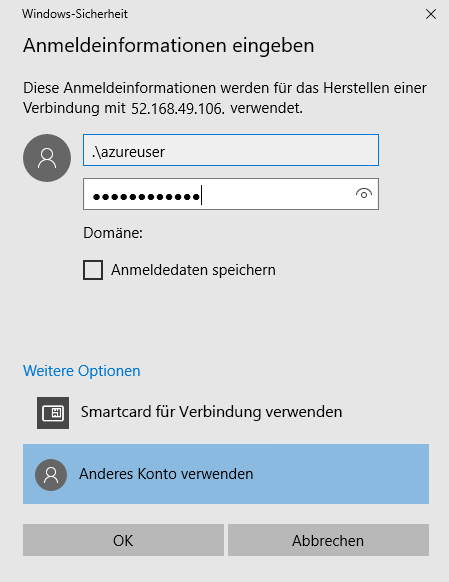
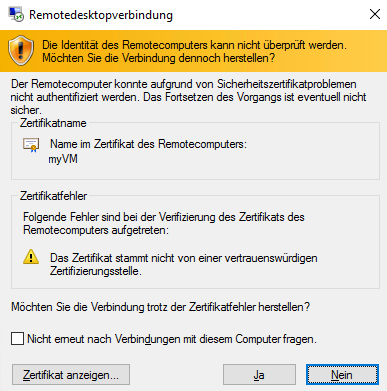

---
wts:
    title: '01 – Erstellen eines virtuellen Computers im Portal (10 Min.)'
    module: 'Modul 02 – Azure-Kerndienste (Workloads)'
---
# 01 – Erstellen eines virtuellen Computers im Portal

In dieser schrittweisen Anleitung erstellen wir einen virtuellen Computer im Azure-Portal, stellen eine Verbindung zum virtuellen Computer her, installieren die Webserverrolle und testen dann. 

**HINWEIS**: Nehmen Sie sich bei dieser exemplarischen Vorgehensweise die Zeit, auf die Informationssymbole zu klicken und diese zu lesen. 

# Aufgabe 1: Den virtuellen Computer erstellen (10 Min.)

In dieser Aufgabe erstellen wir einen virtuellen Windows Server 2019 Datacenter Gen1-Computer. 

1. Melden Sie sich beim [Azure-Portal an (https://portal.azure.com)](https://portal.azure.com?azure-portal=true).

2. Suchen Sie auf dem Blatt **Alle Dienste** nach **Virtuelle Computer**, und wählen Sie diese Option aus. Klicken Sie dann auf **+ Hinzufügen** und wählen Sie **+Virtueller Computer** aus.

3. Auf der Registerkarte **Grundlagen** geben Sie die folgenden Informationen ein (belassen Sie ansonsten die Standardeinstellungen):

    | Einstellungen | Werte |
    |  -- | -- |
    | Abonnement | **Wählen Sie Ihr Abonnement**|
    | Ressourcengruppe | **myRGVM** (Neu erstellen) |
    | Name des virtuellen Computers | **myVM** |
    | Standort | **(US) East US**|
    | Bild | **Windows Server 2019 Datacenter – Gen1**|
    | Größe | Standard D2s v3|
    | Benutzername des Administratorkontos | **azureuser** |
    | Kennwort für das Administratorkonto | **Pa$$w0rd1234**|
    | Regeln für eingehende Ports – Ports auswählen zulassen | **RDP (3389)** und **HTTP (80)**|
    | | |

4. Wechseln Sie zur Registerkarte „Netzwerk“, und suchen Sie nach der Option **Eingangsports auswählen**:

    | Einstellungen | Werte |
    | -- | -- |
    | Eingangsports auswählen | **HTTP (80), RDP (3389)**|
    | | |

**Hinweis** – Stellen Sie sicher, dass die Ports 80 und 3389 ausgewählt sind.

5. Wechseln Sie zur Registerkarte „Verwaltung“, und wählen Sie im Abschnitt **Überwachung** die folgende Einstellung aus:

    | Einstellungen | Werte |
    | -- | -- |
    | Startdiagnose | **Deaktivieren**|
    | | |

6. Übernehmen Sie die verbleibenden Standardeinstellungen, und klicken Sie dann auf die Schaltfläche **Überprüfen + Erstellen** am unteren Rand der Seite.

7. Sobald die Validierung bestanden ist, klicken Sie auf die Schaltfläche **Erstellen**. Die Bereitstellung des virtuellen Computers kann zwischen fünf und sieben Minuten dauern.

8. Sie erhalten Updates auf der Bereitstellungsseite und über den Bereich **Benachrichtigungen** (das Glockensymbol im obersten Menü).

* **Stellen Sie sicher, dass die Ports 80 und 3389 geöffnet wurden**

# Aufgabe 2: Verbindung zum virtuellen Computer herstellen

In dieser Aufgabe stellen wir über RDP eine Verbindung zu unserem neuen virtuellen Computer her. 

1. Suchen Sie nach **myVM**, und wählen Sie Ihren neuen virtuellen Computer aus.

    **HINWEIS**: Sie können auch den Link **Zu Ressource wechseln** auf der Bereitstellungsseite oder den Link zu der Ressource im Bereich **Benachrichtigung** verwenden.

2. Klicken Sie auf dem Blatt **Überblick** des virtuellen Computers auf die Schaltfläche **Verbinden** und wählen Sie **RDP** aus.

    

    **HINWEIS**: In den folgenden Anweisungen erfahren Sie, wie Sie von einem Windows-Computer aus eine Verbindung zu Ihrem virtuellen Computer herstellen. Auf einem Mac benötigen Sie einen RDP-Client wie diesen Remotedesktopclient aus dem Mac App Store. Auf einem Linux-Computer können Sie einen Open Source-RDP-Client verwenden.

2. Auf der Seite **Verbindung zum virtuellen Computer herstellen** behalten Sie die Standardoptionen für die Verbindung mit der öffentlichen IP-Adresse über Port 3389 bei und klicken auf **RDP-Datei herunterladen**.

3. **Öffnen** Sie die heruntergeladene RDP-Datei, und klicken Sie auf **Verbinden**, wenn Sie dazu aufgefordert werden. 

    

4. Wählen Sie im Fenster **Windows-Sicherheit** die Option **Weitere Optionen** und dann **Anderes Konto verwenden** aus. Geben Sie den Benutzernamen (.\azureuser) und das Kennwort (Pa$$w0rd1234) an. Klicken Sie auf **OK**, um die Verbindung herzustellen.

    

5. Möglicherweise erhalten Sie während des Anmeldevorgangs eine Zertifikatwarnung. Klicken Sie auf **Ja**, um die Verbindung herzustellen und eine Verbindung zu Ihrem bereitgestellten virtuellen Computer herzustellen. Sie sollten erfolgreich eine Verbindung herstellen.

    

Herzlichen Glückwunsch! Sie haben einen virtuellen Windows Server-Computer in Azure bereitgestellt und mit ihm eine Verbindung hergestellt

# Aufgabe 3: Webserverrolle installieren und testen

In dieser Aufgabe werden Sie die Webserverrolle auf dem Server installieren und sicherstellen, dass die Standard-IIS-Begrüßungsseite angezeigt werden kann.

1. Öffnen Sie eine PowerShell-Eingabeaufforderung auf dem virtuellen Computer, indem Sie auf die Schaltfläche **Start** klicken, **PowerShell** eingeben, mit der rechten Maustaste auf **Windows PowerShell** klicken und im Kontextmenü **Als Administrator ausführen** auswählen.

    

2. Installieren Sie in dem virtuellen Computer das Feature **Webserver**, indem Sie den folgenden Befehl in der PowerShell-Eingabeaufforderung ausführen. Sie können diesen Befehl kopieren und einfügen.

    ```PowerShell
    Install-WindowsFeature -name Web-Server -IncludeManagementTools
    ```
  
3. Nach Abschluss wird die Eingabeaufforderung **Erfolg** mit dem Wert **Wahr** angezeigt. Sie müssen den virtuellen Computer nicht neu starten, um die Installation abzuschließen. Schließen Sie die RDP-Verbindung zum virtuellen Computer.

    

4. Navigieren Sie im Portal zurück zum Blatt **Überblick** von myVM, und verwenden Sie die Schaltfläche **Zur Zwischenablage klicken**, um die öffentliche IP-Adresse von myVM zu kopieren. Öffnen Sie eine neue Browserregisterkarte, fügen Sie die öffentliche IP-Adresse in das URL-Textfeld ein und drücken Sie die Taste **EINGABE**, um dorthin hin zu wechseln.

    

5. Die Standard-Begrüßungsseite des IIS-Webservers wird geöffnet.

    

Herzlichen Glückwunsch! Sie haben einen Webserver erstellt, auf den über seine öffentliche IP-Adresse zugegriffen werden kann. Wenn Sie eine Webanwendung hosten müssen, können Sie Anwendungsdateien auf dem virtuellen Computer bereitstellen und sie für den öffentlichen Zugriff auf dem bereitgestellten virtuellen Computer hosten.


**HINWEIS**: Um zusätzliche Kosten zu vermeiden, können Sie diese Ressourcengruppe entfernen. Suchen Sie nach Ressourcengruppen, klicken Sie auf Ihre Ressourcengruppe und dann auf **Ressourcengruppe löschen**. Überprüfen Sie den Namen der Ressourcengruppe und klicken Sie dann auf **Löschen**. Überwachen Sie die **Benachrichtigungen**, um zu überprüfen, ob der Löschvorgang erfolgreich abgeschlossen wurde. 
