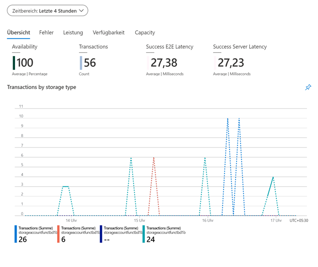

---
wts:
    title: '05 – Blob-Speicher erstellen (5 Min.)'
    module: 'Modul 02 – Core Azure Services (Workloads)'
---
# 05 – Erstellen von Blob-Speicher

In dieser exemplarischen Vorgehensweise erstellen wir ein Speicherkonto und arbeiten dann mit Blob Storage-Dateien.

# Aufgabe 1: Erstellen Sie ein Speicherkonto (5 Min.)

In dieser Aufgabe erstellen wir ein neues Speicherkonto. 

1. Melden Sie sich beim Azure-Portal an unter: <a href="https://portal.azure.com" target="_blank">https://portal.azure.com</a>

2. Suchen Sie auf dem Blatt **Alle Dienste** nach **Speicherkonten**, und wählen Sie diese Option aus. Klicken Sie dann auf **+ Hinzufügen**. 

3. Geben Sie auf dem Blatt **Speicherkonto erstellen** auf der Registerkarte **Grundlagen** die folgenden Informationen ein (ersetzen Sie **xxxx** im Speicherkontonamen durch Buchstaben und Ziffern, sodass der Name global eindeutig ist). Belassen Sie ansonsten die Standardeinstellungen.

    | Einstellung | Wert | 
    | --- | --- |
    | Abonnement | **Wählen Sie Ihr Abonnement** |
    | Ressourcengruppe | **myRGStorage** (neu erstellen) |
    | Speicherkontoname | **storageaccountxxxx** |
    | Standort | **(USA) USA, Osten**  |
    | Leistung | **Standard** |
    | Kontotyp | **StorageV2 (universell v2)** |
    | Replikation | **Lokal redundanter Speicher (LRS)** |
    | | |

    **Hinweis** -  – Denken Sie daran, **xxxx** zu ändern, sodass sich ein eindeutiger **Speicherkontoname** ergibt

5. Klicken Sie auf **Überprüfen + erstellen**, um die Einstellungen Ihres Speicherkontos zu überprüfen und Azure die Validierung der Konfiguration zu ermöglichen. 

6. Klicken Sie nach der Validierung auf **Erstellen**. Warten Sie auf die Benachrichtigung, dass das Konto erfolgreich erstellt wurde. 

7. Suchen Sie auf der Homepage die Option **Speicherkonten**, und wählen Sie sie aus. Stellen Sie sicher, dass Ihr neues Speicherkonto aufgeführt ist.

    

# Aufgabe 2: Arbeiten mit Blob-Speicher

In dieser Aufgabe erstellen wir einen Blob-Container und laden eine Blob-Datei hoch. 

1. Klicken Sie auf den Namen des neuen Speicherkontos, scrollen Sie zum Abschnitt **Blob-Dienst**, und klicken Sie dann auf **Container**.

2. Klicken Sie auf **+ Container**, und vervollständigen Sie die Informationen. Über das Informationssymbol erhalten Sie weitere Informationen. Klicken Sie auf **OK**, wenn Sie fertig sind.

    | Einstellung | Wert |
    | --- | --- |
    | Name | **container1**  |
    | Öffentliche Zugriffsebene| **Privat (kein anonymer Zugang)** |
    | | |

    

4. Klicken Sie auf den Container **container1** und anschließend auf **Hochladen**.

5. Navigieren Sie zu einer Datei auf Ihrem lokalen Computer. 

    **HINWEIS**: Sie können eine leere TXT-Datei erstellen oder eine vorhandene Datei verwenden. Wählen Sie eine kleine Datei, um die Uploadzeit zu minimieren.

6. Klicken Sie auf den Pfeil **Erweitert**, übernehmen Sie die Standardwerte, überprüfen Sie die verfügbaren Optionen, und klicken Sie dann auf **Hochladen**.

    **HINWEIS**: Auf diese Weise können Sie beliebig viele Blobs hochladen. Neue Blobs werden im Container aufgelistet.

7. Klicken Sie nach dem Hochladen der Datei mit der rechten Maustaste auf die Datei und beachten Sie die Optionen „Anzeigen/Bearbeiten“, „Herunterladen“, „Eigenschaften“ und „Löschen“. 

8. Wenn Sie Zeit haben, überprüfen Sie auf dem Blatt „Speicherkonten“ die Optionen für Dateien, Tabellen und Warteschlangen.

# Aufgabe 3: Überwachen des Speicherkontos

1. Kehren Sie bei Bedarf zum Blatt „Speicherkonto“ zurück, und klicken Sie auf **Diagnose und Problembehandlung**. 

2. Untersuchen Sie einige der häufigsten Speicherprobleme. Beachten Sie, dass es mehrere Maßnahmen zur Fehlerbehebung gibt.

3. Scrollen Sie auf dem Blatt „Speicherkonten“ nach unten zum Abschnitt **Überwachung**, und klicken Sie auf **Insights**. Beachten Sie, dass Informationen zu Fehlern, Leistung, Verfügbarkeit und Kapazität vorhanden sind. Ihre Informationen werden davon abweichen.

    

Herzlichen Glückwunsch! Sie haben ein Speicherkonto erstellt und dann mit Speicherblobs gearbeitet.

**HINWEIS**: Um zusätzliche Kosten zu vermeiden, können Sie diese Ressourcengruppe entfernen. Suchen Sie nach Ressourcengruppen, klicken Sie auf Ihre Ressourcengruppe und dann auf **Ressourcengruppe löschen**. Überprüfen Sie den Namen der Ressourcengruppe, und klicken Sie dann auf **Löschen**. Überwachen Sie die **Benachrichtigungen**, um zu sehen, wie der Löschvorgang abläuft.
