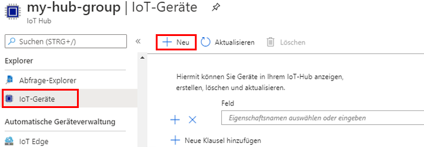

---
wts:
    title: '06 – Implementieren eines Azure IoT Hubs'
    module: 'Modul 02 – Core Azure Services'
---
# 06 – Implementieren eines Azure IoT Hub

In dieser exemplarischen Vorgehensweise konfigurieren wir einen neuen Azure IoT Hub im Azure-Portal und authentifizieren dann eine Verbindung zu einem IoT-Gerät mit Hilfe des Raspberry Pi-Gerätesimulators. Sensordaten und Nachrichten werden vom Raspberry Pi-Simulator an Ihren Azure IoT Hub übergeben, und Sie sehen Metriken für die Meldungsaktivität im Azure-Portal.

# Aufgabe 1: Erstellen eines IoT-Hubs 

In dieser Aufgabe erstellen wir einen IoT-Hub. 

1. Melden Sie sich beim [Azure-Portal](https://portal.azure.com) an.

2. Suchen Sie auf dem Blatt **Alle Dienste** nach **IoT Hub** und wählen Sie diese Option aus; anschließend klicken Sie auf **+ Hinzufügen**.

3. Auf der Registerkarte **Grundlagen** des Blattes **IoT-Hub** füllen Sie die Felder mit den folgenden Details aus (ersetzen Sie **xxxx** im Namen des Speicherkontos mit Buchstaben und Ziffern, so dass der Name global eindeutig ist):

    | Einstellungen | Wert |
    |--|--|
    | Abonnement | **Wählen Sie Ihr Abonnement** |
    | Ressourcengruppe |  **myRGIoT** (Neu erstellen)|
    | Region | **USA, Osten** |
    | IoT Hub-Name | **my-hub-groupxxxx** |
    | | |	

4. Wechseln Sie zur Registerkarte **Größe und Skalierung**, und verwenden Sie die Dropdownliste, um die **Preis- und Skalierungsebene** festzulegen auf **S1: Standard-Tarif**. 

5. Klicken Sie auf die Schaltfläche **Überprüfen + Erstellen**.

6. Klicken Sie auf die Schaltfläche **Erstellen**, um mit der Erstellung Ihrer neuen Azure IoT Hub-Instanz zu beginnen.

7. Warten Sie, bis die Azure IoT Hub-Instanz bereitgestellt ist. 

# Aufgabe 2: IoT-Gerät hinzufügen

In dieser Aufgabe fügen wir dem IoT-Hub ein IoT-Gerät hinzu. 

1. Wenn die Bereitstellung abgeschlossen ist, klicken Sie im Blatt „Bereitstellung“ auf **Zur Ressource wechseln**. Alternativ suchen Sie auf dem Blatt **Alle Dienste** nach **IoT Hub**, wählen diese Option aus und suchen Ihre neue IoT Hub-Instanz

	

2. Scrollen Sie zum Hinzufügen eines neuen IoT-Geräts nach unten zum Abschnitt **Explorer**, und klicken Sie auf **IoT-Geräte**. Klicken Sie dann auf **+ Neu**.

	

3. Geben Sie einen Namen für Ihr neues IoT-Gerät ein ( **myRaspberryPi**), und klicken Sie auf die Schaltfläche **Speichern**. Dadurch wird eine neue IoT-Geräteidentität in Ihrem Azure IoT Hub erstellt.

4. Wenn Sie Ihr neues Gerät nicht sehen, **Aktualisieren** Sie die Seite „IoT-Geräte“. 

5. Wählen Sie **myRaspberryPi** aus, und kopieren Sie den Wert von **Primäre Verbindungszeichenfolge**. Mit diesem Schlüssel werden Sie in der nächsten Aufgabe eine Verbindung zum Raspberry Pi-Simulator authentifizieren.

	

# Aufgabe 3: Gerät mit dem Raspberry Pi-Simulator testen

In dieser Aufgabe testen wir unser Gerät mit dem Raspberry Pi-Simulator. 

1. Öffnen Sie im Webbrowser eine neue Registerkarte, und wechseln Sie zum [Online-Raspberry Pi-Simulator](https://azure-samples.github.io/raspberry-pi-web-simulator/#Getstarted). 

2. Lesen Sie mehr über den Raspberry Pi-Simulator. Wenn ein Übersichts-Popup angezeigt wird, wählen Sie „**X**“, um das Fenster zu schließen.

3. Suchen Sie im Codebereich auf der rechten Seite die Zeile mit der Zeichenfolge „const connectionString =“. Ersetzen Sie dies durch die Verbindungszeichenfolge, die Sie aus dem Azure-Portal kopiert haben. Beachten Sie, dass die Verbindungszeichenfolge die Einträge DeviceId (**myRaspberryPi**) und SharedAccessKey enthält.

	

4. Klicken Sie auf **Ausführen** (unterhalb des Codebereichs), um die Anwendung auszuführen. Die Konsolenausgabe sollte die Sensordaten und Nachrichten anzeigen, die vom Raspberry Pi-Simulator an Ihren Azure IoT Hub gesendet werden. Daten und Nachrichten werden jedes Mal gesendet, wenn die Raspberry Pi-Simulator-LED blinkt. 

	

5. Klicken Sie auf **Beenden**, um das Senden von Daten zu beenden.

6. Kehren Sie zum Azure-Portal und zu Ihrem IoT-Hub zurück.

7. Wechseln Sie zum IoT Hub-Blatt **Überblick** und scrollen Sie nach unten zur Information **IoT Hub-Nutzung**.

	

Herzlichen Glückwunsch! Sie haben Azure IoT Hub so eingerichtet, dass Sensordaten von einem IoT-Gerät erfasst werden.

**Hinweis**: Um zusätzliche Kosten zu vermeiden, können Sie diese Ressourcengruppe entfernen. Suchen Sie nach Ressourcengruppen, klicken Sie auf Ihre Ressourcengruppe und dann auf **Ressourcengruppe löschen**. Überprüfen Sie den Namen der Ressourcengruppe, und klicken Sie dann auf **Löschen**. Überwachen Sie die **Benachrichtigungen**, um zu sehen, wie der Löschvorgang abläuft.
