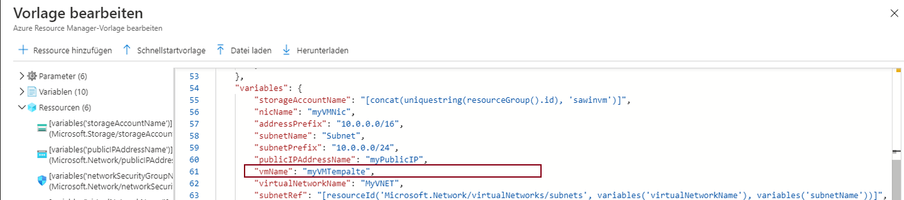

---
wts:
    title: '09 – Erstellen eines virtuellen Computers mit Hilfe einer Vorlage (10 Min.)'
    module: 'Modul 03: Kernlösungen und Verwaltungstools beschreiben'
---
# 09 – Erstellen eines virtuellen Computers mit Hilfe einer Vorlage

In dieser exemplarischen Vorgehensweise stellen wir einen virtuellen Computer mit einer Schnellstartvorlage bereit und untersuchen Überwachungsfunktionen.

# Task1: Durchsuchen Sie die Galerie und suchen Sie eine Vorlage (10 Min.).

In dieser Aufgabe durchsuchen wir die Azure-Schnellstartgalerie und stellen eine Vorlage bereit, mit der ein virtueller Computer erstellt wird. 

1. Greifen Sie in einem Browser auf die [Azure-Schnellstart-Vorlagengalerie](https://azure.microsoft.com/resources/templates?azure-portal=true) zu. In der Galerie finden Sie eine Reihe beliebter und kürzlich aktualisierter Vorlagen. Diese Vorlagen automatisieren die Bereitstellung von Azure-Ressourcen, einschließlich der Installation gängiger Softwarepakete.

2. Durchsuchen Sie die vielen verschiedenen Arten von Vorlagen, die verfügbar sind. 

    **HINWEIS**: Gibt es Vorlagen, die Sie interessieren?

3. Suchen Sie die Vorlage [VM bereitstellen](https://azure.microsoft.com/resources/templates/101-vm-simple-windows?azure-portal=true), oder greifen Sie direkt darauf zu.

    **HINWEIS**: Die Schaltfläche **Bereitstellung in Azure** ermöglicht es Ihnen, die Vorlage über das Azure-Portal bereitzustellen. Während einer solchen Bereitstellung werden Sie nur zur Eingabe eines kleinen Satzes von Konfigurationsparametern aufgefordert. 

4. Klicken Sie auf die Schaltfläche **In Azure bereitstellen**. Ihre Browsersitzung wird automatisch zum [Azure-Portal](http://portal.azure.com/) umgeleitet.

5. Melden Sie sich nach Aufforderung bei dem Azure-Abonnement an, das Sie in diesem Lab verwenden möchten.

6. Klicken Sie auf **Vorlage bearbeiten**. Die Resource Manager-Vorlage verwendet das JSON-Format. Überprüfen Sie die Parameter und Variablen.  Suchen Sie anschließend den Parameter für den Namen des virtuellen Computers. Ändern Sie den Namen zu **myVMTemplate**. **Speichern** Sie Ihre Änderungen. Sie kehren zurück zum Blatt **Benutzerdefinierte Bereitstellung** im Azure-Portal.

    

7. Konfigurieren Sie auf dem Blatt **Benutzerdefinierte Bereitstellung** die für die Vorlage erforderlichen Parameter (ersetzen Sie ***xxxx*** im DNS-Bezeichnungspäfix durch Buchstaben und Ziffern, sodass die Bezeichnung global eindeutig ist). Belassen Sie ansonsten die Standardeinstellungen. 

    | Einstellung| Wert|
    |----|----|
    | Abonnement | **Wählen Sie Ihr Abonnement**|
    | Ressourcengruppe | **myRGTemplate** (Neu erstellen) |
    | Standort | **(USA) USA, Osten** |
    | Admin-Benutzername | **azureuser** |
    | Admin-Kennwort | **Pa$$w0rd1234** |
    | Präfix der DNS-Bezeichnung | **myvmtemplate*xxxx*** |
    | Windows-Betriebssystemversion | **2019-Datencenter** |
    | | |
    
    ** Hinweis: Bei der Nutzung dieser Vorlage fallen keine Kosten an.

9. Klicken Sie auf **Überprüfen + Erstellen**.

10. Überwachen Sie Ihre Bereitstellung. 

# Aufgabe 2: Überprüfen und Überwachen der Bereitstellung Ihres virtuellen Computers

In dieser Aufgabe überprüfen wir, ob der virtuelle Computer ordnungsgemäß bereitgestellt wurde. 

1. Auf dem Blatt **Alle Dienste** suchen und wählen Sie **Virtuelle Computer** aus.

2. Stellen Sie sicher, dass Ihr neuer virtueller Computer erstellt wurde. 

    

3. Wählen Sie Ihren virtuellen Computer aus, und scrollen Sie im Bereich **Übersicht** nach unten, um die Überwachungsdaten anzuzeigen.

    **HINWEIS**: Der Überwachungszeitraum kann von einer Stunde bis zu 30 Tagen angepasst werden.

4. Überprüfen Sie verschiedene Diagramme, einschließlich **CPU (Durchschnitt)**, **Netzwerk (gesamt)**, und **Festplattenbytes (gesamt)**. 

    

5. Klicken Sie auf ein Diagramm. Beachten Sie, dass Sie eine **Metrik hinzufügen** und den Diagrammtyp ändern können.

6. Kehren Sie zum Blatt **Übersicht** zurück.

7. Klicken Sie auf **Aktivitätsprotokoll** (linker Bereich). In Aktivitätsprotokollen werden Ereignisse wie das Erstellen oder Ändern von Ressourcen aufgezeichnet. 

8. Klicken Sie auf **Filter hinzufügen**, und experimentieren Sie mit der Suche nach verschiedenen Ereignistypen und Operationen. 

    

**HINWEIS**: Um zusätzliche Kosten zu vermeiden, können Sie diese Ressourcengruppe entfernen. Suchen Sie nach Ressourcengruppen, klicken Sie auf Ihre Ressourcengruppe und dann auf **Ressourcengruppe löschen**. Überprüfen Sie den Namen der Ressourcengruppe und klicken Sie dann auf **Löschen**. Überwachen Sie die **Benachrichtigungen**, um zu sehen, wie der Löschvorgang abläuft.
