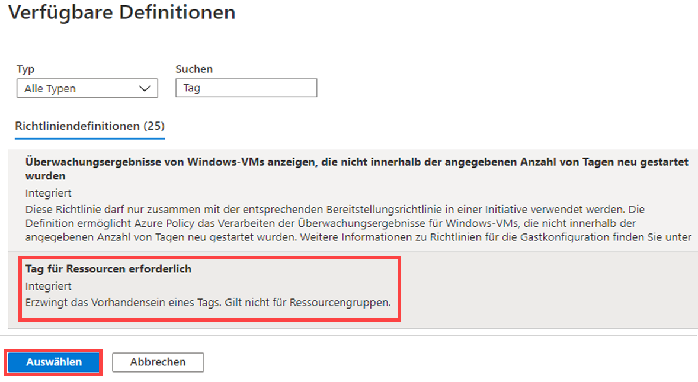

---
wts:
    title: '16 – Implementieren des Ressourcentaggings (5 Min.)'
    module: 'Modul 05: Beschreiben der Features für Identität, Governance, Datenschutz und Compliance'
---
# 16 – Implementieren des Ressourcentaggings

In dieser exemplarischen Vorgehensweise erstellen wir eine Richtlinienzuweisung, für die Tagging erforderlich ist, erstellen ein Speicherkonto und testen das Tagging, zeigen Ressourcen mit einem angegebenen Tag an und entfernen die Tagging-Richtlinie.

# Aufgabe 1: Erstellen einer Richtlinienzuweisung (5 Min.)

In dieser Aufgabe konfigurieren wir die Richtlinie **Einen Tag für Ressourcen anfordern** und weisen sie unserem Abonnement zu. 

1. Melden Sie sich beim [Azure-Portal](https://portal.azure.com) an.

2. Suchen Sie auf dem Blatt **Alle Dienste** nach **Richtlinie**, und wählen Sie diese Option aus.

3. Scrollen Sie nach unten zum Abschnitt **Dokumenterstellung**, klicken Sie  auf **Aufgaben**, und klicken Sie dann oben auf der Seite auf **Richtlinie zuweisen**.

4. Beachten Sie, dass der **Bereich** für unsere Richtlinie abonnementweit sein wird. 

5. Wählen Sie die Schaltfläche mit den Auslassungspunkten (**Richtliniendefinition**) aus (am Ende des Textfelds rechts). **Suchen** Sie nach Richtliniendefinitionen mit dem Wert **Tag**. Klicken Sie in der Ergebnismenge auf die Definition  **Tag für Ressourcen erforderlich**, und klicken Sie dann auf **Auswählen**.

   

6. Geben Sie auf dem Blatt **Richtlinie zuweisen** auf der Registerkarte **Parameter** die Zeichenfolge **Unternehmen** als Tag-Name ein. Klicken Sie auf **Überprüfen + Erstellen** und dann auf **Erstellen**.

    **Hinweis:** Dies ist ein einfaches Beispiel, um das Tagging zu demonstrieren. 

    

7. Die Richtlinienzuweisung **Tag für Ressourcen erforderlich** ist jetzt vorhanden. Wenn eine Ressource erstellt wird, muss sie ein Tag mit dem Unternehmensschlüssel enthalten.

   

# Aufgabe 2: Erstellen Sie ein Speicherkonto zum Testen des erforderlichen Taggings.

In dieser Aufgabe erstellen wir Speicherkonten, um das erforderliche Tagging zu testen. 

1. Suchen Sie im Azure-Portal auf dem Blatt **Alle Dienste** nach **Speicherkonten**, und wählen Sie diese Option aus. Klicken Sie anschließend auf **+ Hinzufügen**.

2. Geben Sie auf dem Blatt **Speicherkonto erstellen** auf der Registerkarte **Grundlagen** die folgenden Informationen ein (ersetzen Sie **xxxx** im Speicherkontonamen durch Buchstaben und Ziffern, sodass der Name global eindeutig ist). Belassen Sie ansonsten die Standardeinstellungen.

    | Einstellung | Wert | 
    | --- | --- |
    | Abonnement | **Verwenden Sie Ihr Abonnement** |
    | Ressourcengruppe | **myRGTags** (Neu) |
    | Name des Speicherkontos | **storageaccountxxxx** |
    | Ort | **(USA) USA, Osten** |
    | | |

3. Klicken Sie auf **Überprüfen + Erstellen**. 

    **Hinweis:** Wir testen, was passiert, wenn das Tag nicht angegeben wird. 

4. Sie erhalten eine Nachricht, dass die Validierung fehlgeschlagen ist. Klicken Sie auf die Nachricht **Hier klicken, um Details anzuzeigen**. Auf dem Blatt **Fehler** wird auf der Registerkarte **Zusammenfassung** eine Fehlermeldung angezeigt, die besagt, dass die Ressource von der Richtlinie nicht zugelassen wurde.

    **Hinweis:** Wenn Sie die Registerkarte „Unformatierter Fehler“ anzeigen, wird der erforderliche spezifische Tagname angezeigt. 

    

    **Hinweis – Sie müssen 30 Minuten warten, bis das Markieren abgeschlossen ist.** 

5. Schließen Sie den Bereich **Fehler**, und klicken Sie auf **Zurück** (unterer Bildschirmrand). Geben Sie die Tagging-Informationen an. 

    | Einstellung | Wert | 
    | --- | --- |
    | Tag-Name | **Unternehmen** (möglicherweise nicht in der Dropdownliste) |
    | Tag-Wert | **Contoso** |
    | | |

6. Klicken Sie auf **Überprüfen + Erstellen**, und überprüfen Sie, ob die Validierung erfolgreich war. Klicken Sie auf **Erstellen**, um das Speicherkonto bereitzustellen. 

# Aufgabe 3: Zeigen Sie alle Ressourcen mit einem bestimmten Tag an

1. Suchen Sie im Azure-Portal auf dem Blatt **Alle Dienste** nach **Tags**, und wählen Sie diese Option aus.

2. Notieren Sie alle Tags und ihre Werte. Klicken Sie auf **Unternehmen: Contoso** Schlüssel-Wert-Paar. Daraufhin wird ein Blatt mit dem neu erstellten Speicherkonto angezeigt, sofern Sie das Tag während der Bereitstellung einbezogen haben. 

   

3. Zeigen Sie im Portal das Blatt **Alle Ressourcen** an.

4. Klicken Sie auf **Filter hinzufügen**, und fügen Sie den Tag-Schlüssel **Unternehmen** als Filterkategorie hinzu. Wenn der Filter angewendet wird, wird nur Ihr Speicherkonto aufgelistet.

    

# Aufgabe 4: Richtlinienzuweisung löschen

In dieser Aufgabe werden wir die Richtlinie **Tag für Ressourcen erforderlich** entfernen, so dass sie unsere zukünftige Arbeit nicht beeinflusst. 

1. Suchen Sie im Portal im Blatt **Alle Dienste** nach dem Punkt **Richtlinie**, und wählen Sie ihn aus.

2. Klicken Sie auf den Richtlinieneintrag **Tag für Ressourcen erforderlich**.

3. Klicken Sie im obersten Menü auf **Zuweisung löschen**.

4. Bestätigen Sie, dass Sie die Richtlinienzuweisung löschen möchten, indem Sie im Dialogfeld **Zuweisung löschen** auf **Ja** klicken.

5. Wenn Sie Zeit haben, erstellen Sie eine weitere Ressource ohne Tag, um sicherzustellen, dass die Richtlinie nicht mehr gültig ist.

In dieser exemplarischen Vorgehensweise haben wir eine Richtlinienzuweisung erstellt, für die Tagging erforderlich ist, ein Speicherkonto erstellt und das Tagging getestet, Ressourcen mit einem angegebenen Tag angezeigt und die Tagging-Richtlinie entfernt.

**Hinweis**: Um zusätzliche Kosten zu vermeiden, können Sie diese Ressourcengruppe entfernen. Suchen Sie nach Ressourcengruppen, klicken Sie auf Ihre Ressourcengruppe und dann auf **Ressourcengruppe löschen**. Überprüfen Sie den Namen der Ressourcengruppe, und klicken Sie dann auf **Löschen**. Überwachen Sie die **Benachrichtigungen**, um zu sehen, wie der Löschvorgang abläuft.
