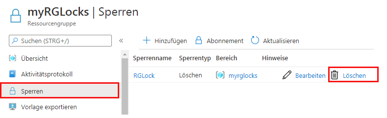

---
wts:
    title: '16 – Verwalten von Ressourcensperren'
    module: 'Modul 03 – Sicherheit, Datenschutz, Compliance und Vertrauen'
---
# 16 – Verwalten von Ressourcensperren

In dieser exemplarischen Vorgehensweise erstellen wir eine Ressourcengruppe, fügen der Ressourcengruppe eine Sperre hinzu und testen das Löschen, testen das Löschen einer Ressource in der Ressourcengruppe und entfernen die Ressourcensperre. 

# Aufgabe 1: Erstellen einer Ressourcengruppe

In dieser Aufgabe erstellen wir für diese Übung eine Ressourcengruppe. 

1. Melden Sie sich beim [Azure-Portal](https://portal.azure.com) an.

2. Suchen Sie im Blatt **Alle Dienstleistungen** nach **Ressourcengruppen** und wählen Sie es aus. Wählen Sie dann **+ Hinzufügen** aus.

3. Erstellen Sie eine neue Ressourcengruppe. Wenn Sie fertig sind, klicken Sie auf **Überprüfen + Erstellen** und dann auf **Erstellen**. 

    | Einstellung | Wert |
    | -- | -- |
    | Abonnement | **Verwenden Sie Ihr Abonnement** |
    | Name | **myRGLocks** |
    | Region | **(USA) USA, Osten** |
    | | |

# Aufgabe 2:  Sperre zur Ressourcengruppe hinzufügen und das Löschen testen

In dieser Aufgabe fügen wir der Ressourcengruppe eine Ressourcensperre hinzu und testen das Löschen der Ressourcengruppe. 

1. Navigieren Sie im Azure-Portal zu der neu erstellten Ressourcengruppe **myRGLocks**.

2. Sie können eine Sperre auf ein Abonnement, eine Ressourcengruppe oder eine einzelne Ressource anwenden, um ein versehentliches Löschen oder Ändern kritischer Ressourcen zu verhindern. 

3. Klicken Sie im Abschnitt **Einstellungen** auf **Sperren** und dann auf **+ Hinzufügen**. 

    

4. Konfigurieren Sie die neue Sperre. Klicken Sie anschließend auf **OK**. 

    | Einstellung | Wert |
    | -- | -- |
    | Sperrenname | **RGLock** |
    | Sperrtyp | **Löschen** |
    | | |

5. Klicken Sie auf **Übersicht** und dann auf **Ressourcengruppe löschen**. Geben Sie den Namen der Ressourcengruppe ein, und klicken Sie anschließend auf **OK**. Sie erhalten eine Fehlermeldung, dass die Ressourcengruppe gesperrt ist und nicht gelöscht werden kann.

    

# Aufgabe 3: Testlöschung eines Mitglieds der Ressourcengruppe

In dieser Aufgabe testen wir, ob die Ressourcensperre ein Speicherkonto in der Ressourcengruppe schützt. 

1. Suchen Sie auf dem Blatt **Alle Dienste** nach **Speicherkonten**, und wählen Sie diese Option aus. Klicken Sie dann auf **+ Hinzufügen**. 

2. Geben Sie auf dem Blatt **Speicherkonto erstellen** auf der Registerkarte **Grundlagen** die folgenden Informationen ein (ersetzen Sie **xxxx** im Speicherkontonamen durch Buchstaben und Ziffern, sodass der Name global eindeutig ist). Belassen Sie ansonsten die Standardeinstellungen.

    | Einstellung | Wert | 
    | --- | --- |
    | Abonnement | **Wählen Sie Ihr Abonnement** |
    | Ressourcengruppe | **myRGLocks** |
    | Name des Speicherkontos | **storageaccountxxxx** |
    | Ort | **(USA) USA, Osten**  |
    | Leistung | **Standard** |
    | Kontotyp | **StorageV2 (universell v2)** |
    | Replikation | **Lokal redundanter Speicher (LRS)** |
    | Zugriffsebene (Standard) | **Heiße Ebene** |
    | | |

3. Klicken Sie auf **Überprüfen + Erstellen** um die Einstellungen Ihres Speicherkontos zu überprüfen und Azure die Überprüfung der Konfiguration zu ermöglichen. 

4. Klicken Sie nach der Validierung auf **Erstellen**. Warten Sie auf die Benachrichtigung, dass das Konto erfolgreich erstellt wurde. 

5.  Warten Sie auf die Benachrichtigung, dass das Speicherkonto erfolgreich erstellt wurde. 

6. Greifen Sie auf Ihr neues Speicherkonto zu, und klicken Sie im Bereich **Übersicht** auf **Löschen**. Sie erhalten eine Fehlermeldung, dass die Ressource oder die übergeordnete Ressource über eine Löschsperre verfügt. 

    

    **Hinweis**: Obwohl wir keine Sperre speziell für das Speicherkonto erstellt haben, haben wir eine Sperre auf der Ressourcengruppenebene erstellt, die das Speicherkonto enthält. Als solches verhindert die *übergeordnete* Ebenensperre, dass wir die Ressource löschen, und das Speicherkonto übernimmt die Sperre vom übergeordneten Element.

# Aufgabe 4:  Ressourcensperre entfernen

In dieser Aufgabe entfernen wir die Ressourcensperre und testen. 

1. Wechseln Sie wieder zum Ressourcengruppen-Blatt **myRGLocks**, und klicken Sie im Abschnitt **Einstellungen** auf **Sperren**.
    
2. Klicken Sie den Link **Löschen** rechts neben dem Eintrag **RGLock**.

    

3. Kehren Sie in das Blatt „Speicherkonto“ zurück und bestätigen Sie, dass Sie die Ressource jetzt löschen können.

Herzlichen Glückwunsch! Sie haben eine Ressourcengruppe erstellt, der Ressourcengruppe eine Sperre hinzugefügt und das Löschen getestet, das Löschen einer Ressource in der Ressourcengruppe getestet und die Ressourcensperre entfernt. 

**Hinweis**: Um zusätzliche Kosten zu vermeiden, können Sie diese Ressourcengruppe entfernen. Suchen Sie nach Ressourcengruppen, klicken Sie auf Ihre Ressourcengruppe und dann auf **Ressourcengruppe löschen**. Überprüfen Sie den Namen der Ressourcengruppe, und klicken Sie dann auf **Löschen**. Überwachen Sie die **Benachrichtigungen**, um zu sehen, wie der Löschvorgang abläuft.