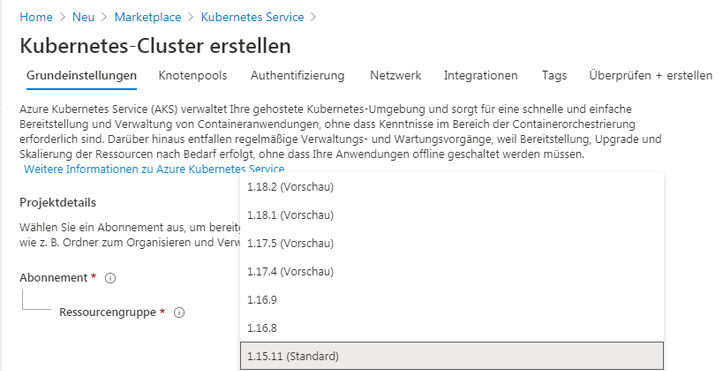
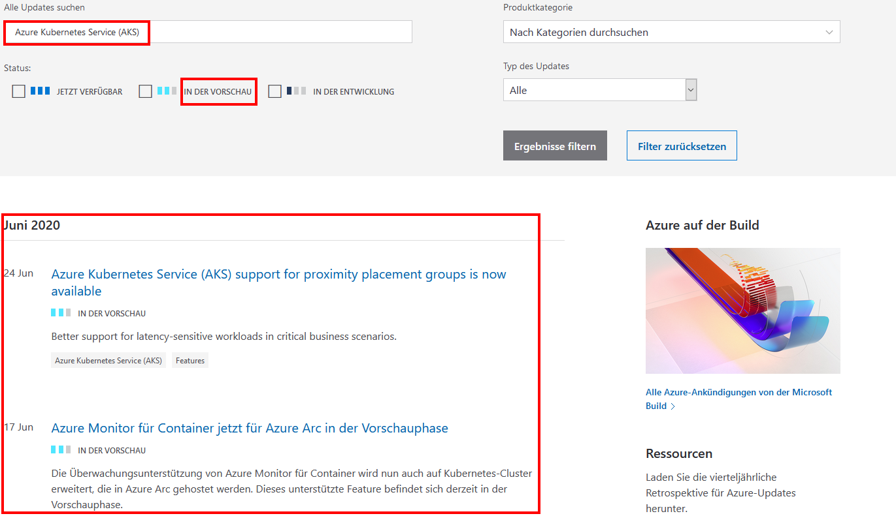

---
wts:
    title: '23 – Zugriff auf Azure-Vorschaufunktionen'
    module: 'Modul 04 – Azure-Preise und -Support'
---

# 23 – Zugriff auf Azure-Vorschaufunktionen

In dieser exemplarischen Vorgehensweise greifen wir auf Azure-Vorschaudienste und -funktionen zu, identifizieren sie und zeigen Informationen zu den neuesten Azure-Updates an.

# Aufgabe 1: Zugreifen auf Vorschaudienste und -funktionen

In dieser Aufgabe werden wir die Features der Marktplatzvorschau durchgehen. 

1. Melden Sie sich beim [Azure-Portal](https://portal.azure.com) an.

2. Suchen und wählen Sie im Blatt **Alle Dienstleistungen** **Marketplace** aus. 

3. Durchsuchen Sie Marketplace nach **Vorschau**. Überprüfen Sie alle Vorschauprodukte, die Sie interessieren. 

4. Suchen Sie im Marketplace nach **Kubernetes Service**. Wählen Sie Kubernetes Service und klicken Sie auf **Erstellen**.

5. In der Dropdown-Meldung der **Kubernetes-Version** gibt es eine **Vorschau**-Version. Nicht für alle Dienste gibt es eine Vorschauversion. 

    

    **Hinweis**: In diesen Szenarien, in denen neue Funktionen oder Features innerhalb eines vorhandenen allgemein verfügbaren Azure-Dienstes oder -Produkts verfügbar gemacht werden, obwohl Sie den Azure-Dienst möglicherweise in der Produktion verwenden, ist die Vorschaufunktion möglicherweise noch nicht für Produktionsbereitstellungen bereit. Sie sollten sicherstellen, dass Sie alle Einschränkungen bei der Verwendung von Vorschauversionen kennen, bevor Sie sie in der Produktion bereitstellen.

# Aufgabe 2: Überprüfung der Seite „Azure Updates“

In dieser Aufgabe gehen wir die Seite „Azure Updates“ durch.

1. Navigieren Sie in einem Browser zur Seite [Azure-Updates](https://azure.microsoft.com/de-de/updates/). 

2. Beachten Sie , dass es statusbasierte Filteroptionen namens **Jetzt erhältlich**, **Vorschau** und **In Entwicklung** gibt.

3. Aktivieren Sie das Kontrollkästchen **In der Vorschau**, geben Sie **Kubernetes** in das Textfeld der Schlüsselwortsuche ein, und drücken Sie dann auf die **EINGABETASTE**. 

    **Hinweis**: Die Seite gibt eine Liste der Elemente in der Vorschau zurück, die sich auf Kubernetes beziehen. Ihre Ergebnisliste kann unterschiedlich sein. 

    

4. Klicken Sie auf ein Element in der Ergebnisliste, um detaillierte Informationen zu erhalten. 

5. Wechseln Sie zurück zur Seite **Azure-Updates**, zeigen Sie Elemente an, die jetzt den Status **Allgemeine Verfügbarkeit** haben, indem Sie das Kontrollkästchen **Jetzt verfügbar** aktivieren und das Kontrollkästchen **Vorschau** deaktivieren. Überprüfen Sie alle von der Suche zurückgegebenen Elemente, die für Sie von Interesse sind.

6. Wechseln Sie zurück zur Seite **Azure-Updates**, aktivieren Sie das Kontrollkästchen **In Entwicklung**, und deaktivieren Sie das Kontrollkästchen **Jetzt verfügbar**. Überprüfen Sie alle von der Suche zurückgegebenen Elemente, die für Sie von Interesse sind.

Herzlichen Glückwunsch! Sie haben Azure-Vorschaudienste und -Funktionen identifiziert und darauf zugegriffen sowie Informationen zu den letzten Azure-Updates angezeigt.

